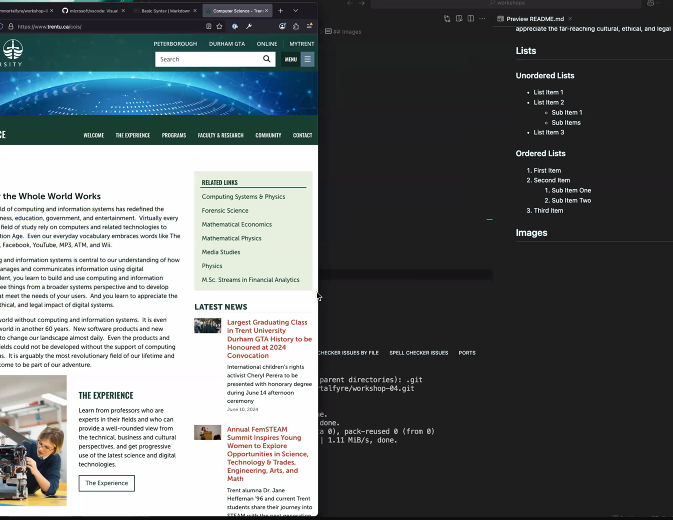

# Workshop 4

By: Matthew Hellard

## Emphasis

_Lorem_ ipsum _dolor_ sit amet, consectetur adipiscing elit, sed do eiusmod tempor incididunt ut labore et dolore magna aliqua. _Ut enim_ ad minim veniam, quis nostrud exercitation ullamco laboris nisi ut aliquip ex ea commodo consequat. _Duis aute irure dolor in reprehenderit_ in voluptate velit esse cillum dolore eu fugiat nulla pariatur. Excepteur sint occaecat cupidatat non proident, sunt in culpa qui officia deserunt mollit anim id est laborum.

## Strong

**Lorem** ipsum **dolor** sit amet, consectetur adipiscing elit, sed do eiusmod **tempor** incididunt ut labore et dolore magna aliqua. Ut enim ad minim veniam, quis nostrud exercitation ullamco laboris nisi ut aliquip ex ea **commodo consequat**. Duis aute irure dolor in reprehenderit in voluptate velit esse cillum dolore eu fugiat nulla pariatur. Excepteur sint **occaecat** cupidatat non proident, sunt in culpa qui officia deserunt mollit anim id est laborum.

## Lists

### Unordered Lists

- List Item 1
- List Item 2
  - Sub Item 1
  - Sub Item 2
- List Item 3

### Ordered Lists

1. First Item
2. Second Item
   1. Sub Item One
   2. Sub Item Two
3. Third Item

## Images



## Hyperlinks

[zoom](https://www.zoom.com)

## Including Code

### Inline Code

In HTML the `` tag is used to display pictures

### Code Fences

```html
<nav>
  <ul>
    <li><a href="index.html">Home</a></li>
    <li><a href="grid.html">Grid</a></li>
    <li><a href="https://trentu.ca">Trent</a></li>
    <li><a href="https://loki.trentu.ca">Loki</a></li>
  </ul>
</nav>
```

```css
body {
  font-family: system-ui, -apple-system, BlinkMacSystemFont, "Segoe UI", Roboto,
    Oxygen, Ubuntu, Cantarell, "Open Sans", "Helvetica Neue", sans-serif;
  height: 100vh;
  display: flex;
  flex-direction: column;
}
```
